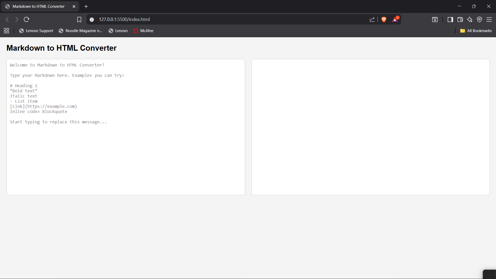
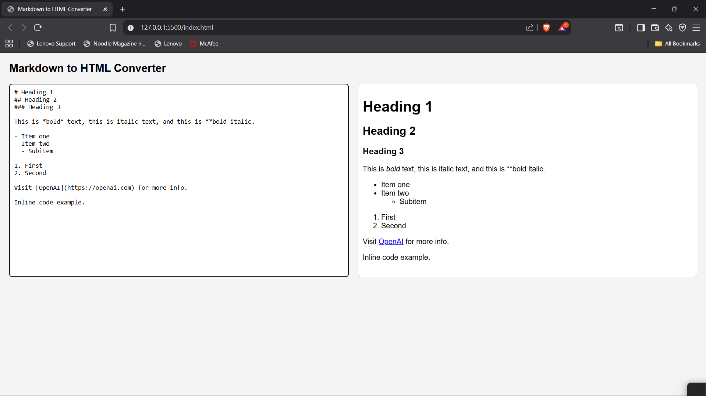

# Markdown to HTML Converter

## Overview

This project is a simple web-based Markdown to HTML converter. It allows users to enter Markdown syntax and instantly see the corresponding HTML preview. The converter supports common Markdown features including:

- Headings (e.g., #, ##, ###)  
- Bold and italic text  
- Ordered and unordered lists  
- Links  
- Inline code and code blocks  
- Blockquotes  

## Features

- *Live Preview:* The HTML preview updates automatically as you type without needing a convert button.  
- *User Instructions:* The input textarea shows helpful instructions when the page loads, which clear as the user starts typing.  
- *Clean UI:* A simple and responsive layout for ease of use.  
- *Reliable Parsing:* Uses the popular [marked.js](https://github.com/markedjs/marked) library for accurate Markdown parsing with GitHub Flavored Markdown (GFM) support.

## Demo

Here is a screenshot showing the converter interface in action:

## How to Use

1. Open the index.html file in any modern web browser.  
2. Type or paste Markdown text in the left textarea.  
3. View the live HTML preview on the right side as you type.  

## Technologies Used

- HTML5  
- CSS3  
- JavaScript (ES6)  
- [marked.js](https://github.com/markedjs/marked) library for Markdown parsing  

## Project Structure

/ (root directory) ├── index.html      # Main HTML page
├── styles.css      # CSS styles
├── script.js       # JavaScript logic
└── images          # Folder containing screenshots
└── screenshot1.png

## Notes

- The project currently does not sanitize HTML output. For production use, adding a sanitizer like [DOMPurify](https://github.com/cure53/DOMPurify) is recommended to prevent potential security issues such as XSS.  
- The user interface is intentionally kept simple, focusing on functionality and clarity.  

## Contact

If you have any questions or feedback, please feel free to reach out.

---

Thank you for reviewing my project!

---

Best regards,  
*Urva patel*
